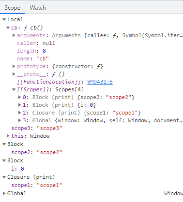

# 浏览器原理

## 浏览器进程和线程

### 浏览器主进程

负责界面显示、用户交互、子进程管理，同时提供存储等功能。

### 渲染进程(内核)

- GUI 线程
负责界面的渲染，解析 html，css，构建 DOM，CSSOM，render tree，layout，paint，重排/重绘等。在 js 线程执行期间，该线程会挂起。
- js 引擎线程
负责 js 代码的执行，与 GUI 线程是互斥的。
- 事件触发线程
用来控制事件循环，当一个事件触发时该线程会把事件添加到待处理队列的队尾，等待 js 线程的执行。这些事件可以是定时任务，鼠标点击，ajax 异步请求等。
- 定时触发器线程
setTimeout 和 setInterval所在线程。由于 js 引擎是单线程的，如果处于阻塞线程状态就会影响记计时的准确，因此通过单独线程来计时并触发定时是更为合理的方案。

### 网络进程

主要负责页面网络资源加载。

### 插件进程

主要负责插件运行。

### GPU 进程

GPU 初衷是为了实现3D CSS效果。随着发展，Chrome 的 UI 界面都采用 GPU 绘制。

## 输入 url 之后发生了什么

1. 三次握手
2. 四次握手
3. 请求资源
4. 解析 html，转成 token
5. 一边构建 DOM 树，请求资源（此时会有强缓存和协商缓存的判断）
6. 请求到的 css 资源会交给 css 解析器，生成 CSSOM 树
7. js 交给 js 引擎解析
8. 将 DOM 和 CSSOM 合成渲染树
9. layout 计算出渲染树每个节点的具体坐标位置
10. layerize 图层化，根据层级关系分图层（在 chrome 的 layer 标签可以看到图层）
11. paint 绘制图层，调用 canvas api
12. rasterization 光栅化，生成每个像素的颜色值
13. 输出到页面

## 浏览器内核

- Trident内核（-ms-），IE
- Webkit内核（-webkit-），Safari
- Gecko内核（-moz-），Firefox

另外还有 Chrome 基于 webkit 改造的 Blink 内核

## web worker

> Web Worker为Web内容在后台线程中运行脚本提供了一种简单的方法。线程可以执行任务而不干扰用户界面。此外，他们可以使用XMLHttpRequest执行 I/O  (尽管responseXML和channel属性总是为空)。一旦创建， 一个worker 可以将消息发送到创建它的JavaScript代码, 通过将消息发布到该代码指定的事件处理程序（反之亦然）。本文提供了有关使用Web Worker的详细介绍

由于 js 是单线程的，无法胜任 cpu 密集型的计算。对于复杂的处理逻辑，可以放在 worker 中处理。当然，worker 中依然是无法操作 DOM 的。

- 创建 worker 时，浏览器会开辟一个子线程
- js 线程和 worker 线程间通过 postMessage 的方式通信

## 编译过程

## 垃圾回收

JavaScript 是一门自动垃圾回收的语言，由 V8 完成垃圾回收。

### 主要流程

1. 通过 GC Root 标记空间中的活动对象和非活动对象
    在浏览器环境中 GC Root 有很多，通常包括：
    - 全局 window 对象
    - 文档 DOM 树
    - 存放站上变量
    V8 采用的是可访问性算法来判断堆中的对象是否为活动对象。从 GC Root 触发，遍历 GC Root 中所有对象：
    - 通过 GC Root 遍历到的对象，我们就认为该对象是可访问的，也称为活动对象，必须保证这些对象应该在内存中保留。
    - 通过 GC Root 没有遍历到的对象，则是不可访问的，也称为非活动对象，这些对象就可能被回收。
2. 回收非活动对象所占的内存，在所有标记完成后，统一清理内存中标记为可回收的对象。
3. 内存整理。频繁回收对象后，内存中就会存在大量不连续空间，即内存碎片。如果不整理内存碎片，就可能在分配较大内存时出现内存不足的情况。

### 代际假说

代际假说有以下两个特点：

- 大部分对象在内存中存活时间很短，如函数内部声明的变量，块级作用域中的变量。
- 不死的对象，会活得更久，如全局的 window、DOM、web API 等。

在该假说的基础上，V8 把堆分成新生代和老生代

- 新生代是生存时间短的对象
- 老生代是生存时间长的对象
并且分成了两个垃圾回收器
- 主垃圾回收器-Major GC，主要负责老生代的垃圾回收
- 副垃圾回收器-Minor GC(Scavenger)，主要负责新生代的垃圾回收

### 副垃圾回收器（新生区）

副垃圾回收器主要负责新生代的垃圾回收，通常情况下，大多数小的对象会被分配到新生代。

#### Scanvenge 算法

新生代中的垃圾数据用 Scanvenge 算法处理，将新生代空间对半分成两个区域，一半是对象区域（from-space），一半是空闲区域（to-space）。这两个空间，始终只有一个属于使用状态，另一个属于闲置状态。  
新加入的对象会存放到 form space，当 from space 快写满时，就需要执行一次垃圾清理操作。  

1. 先对 form space 的垃圾进行标记。
2. 副垃圾回收器将存活的对象复制到 to-space 中，同时将对象有序地进行排列，所以在复制过程中，相当于完成了内存整理的操作，复制后to-space 是没有内存碎片的。
3. 复制完成后，将 from space 清空，再将 from space 和 to space 进行角色翻转。

由于复制操作需要时间成本，为了执行效率，一般新生区的空间都会设置的比较小。

#### 新生区的对象晋升

因为新生区空间不大，所以很容易被存活的对象装满。当一个对象经过多次复制后存活，就可以视为一个生命周期较长的对象。在下一次垃圾回收时，就会被转移到老生区中，这就是对象晋升。对象晋升需要满足一下两个条件之一：

- 对象是否经历过一次 Scanvenge 算法
- to space 的内存占比是否已经超过 25%

### 主垃圾回收器（老生区）

主垃圾回收器主要负责老生代的垃圾回收。除了新生区中晋升的对象，一些打的对象会直接分配到老生区中。因此老生区对象有两个特点：

- 对象占用空间大
- 对象存活时间长

#### 标记-清除算法

由于老生代的对象比较大，如果是用 Scanvenge 算法进行垃圾回收，复制大对象会花费较多时间，导致执行效率不高。因此，主垃圾回收器采用的是标记-清除（Mark-Sweep）算法。

1. 标记阶段：从一组根元素触发，递归遍历这组根元素，在遍历过程中，能到达的元素称为活动对象，没有到达的元素标记为垃圾数据
2. 清除阶段：与副回收器不用的是，主回收器会直接清理掉标记为垃圾的数据

#### 标记-整理算法

由于标记-清除后，会产生大量不连续的内存碎片，于是引入了另外一种算法，标记-整理：

1. 标记阶段：从一组根元素触发，递归遍历这组根元素，在遍历过程中，能访问到的节点称为活动对象，无法到达的节点标记为垃圾数据
2. 整理阶段：与标记清除不同的是，这一阶段会让所有的活动对象向一端移动，然后直接清理掉这一端之外的内存

### 附：引用计数算法

引用计数是垃圾回收算法的一种。如果一个对象没有其他引用指向它，则该对象会被视为垃圾并回收。  
但是如果碰到循环引用，如两个对象相互引用，就能绕过该算法，造成内存泄露。

## 作用域和变量/激活对象

### 作用域

javascript 的作用域为静态作用域，也称词法作用域，即函数的作用域在函数定义时就决定了。

```js
var scope = "global scope";
function checkscope(){
  var scope = "local scope";
  function f(){
      return scope;
  }
  return f();
}
checkscope();
```

```js
var scope = "global scope";
function checkscope(){
  var scope = "local scope";
  function f(){
      return scope;
  }
  return f;
}
checkscope()();
```

以上代码都会打印出 local scope，原因是静态作用域中，函数的作用域基于函数创建的位置。

#### 作用域链

当查找变量时，会先从当前上下文的变量对象中查找，如果没有找到，会从父级的上下文的变量对象中找，直到到达全局变量，这就是作用域链。

### VO 和 AO

VO(variable object) 变量对象，是与执行上下文相关的数据作用域，存储上下文中定义的变量和函数声明。
AO(activation object) 活动对象，在函数执行时，这个执行上下文的变量对象就会被激活，变成活动对象。

### 执行过程

执行上下文的代码会分成两个步骤：

- 进入执行上下文  
- 代码执行

#### 进入执行上下文

当进入执行上下文时，还没有执行代码，此时的变量对象包含：

1. 函数形参
    - 名称和对应值组成的一个变量对象的属性被创建
    - 没有实参，属性值为 undefined
2. 函数声明(function a() {})
    - 由名称和对应值（函数对象(function-object)）组成的一个变量对象的属性被创建
    - 如果变量对象已经存在相同名称的属性，则完全替代这个属性
3. 变量声明(关键字声明，如 var)
    - 有名称和对应值（undefined）组成一个变量对象的属性被创建
    - 如果变量名称跟已经声明的形参或函数的变量对象相同，则变量声明不会干扰已经存在的这类属性  

这也解释了函数声明提升等现象。  

#### 执行过程示例

```js
function foo(a) {
  var b = 2;
  function c() {}
  var d = function() {};
  b = 3;
}
foo(1);
```

进入执行上下文，此时函数还未执行，AO 为：

```js
AO = {
  arguments: {
    0: undefined,
    length: 1
  },
  a: undefined,
  b: undefined,
  c: reference to function c() {},
  d: undefined
}
```

代码执行完成后，此时 AO 为：

```js
AO = {
  arguments: {
    0: 1,
    length: 1
  },
  a: 1,
  b: 3,
  c: reference to function c() {},
  d: reference to FunctionExpression "d"
}
```

### 执行上下文的作用域

函数的作用域在词法分析的时中就已经确定，在执行时会创建 `[[Scopes]]` 属性，是一个数组，表示其父级的作用域，包含但不一定全都有以下几种：

- Block 块级作用域
- Closure 闭包作用域
- Global 全局作用域

```js
function print() {
  let scope1 = 'scope1';
  for (let i = 0; i < 3; i++) {
    let scope2 = 'scope2';
    setTimeout(function cb(){
      let scope3 = 'scope3';
      debugger
      console.log(i, scope1, scope2, scope3, print, cb);
    },0);
  }
}
print();
```

以上代码复制到控制台执行后，命中断点，可以看到作用域信息。  
  
命中断点时的作用域其实就是 `[Local].concat(cb['[[Scopes]]'])`，本地的执行上下文加上父级函数的作用域。  
注意，由于作用域是在词法分析阶段就已确定，所以如果把 `console.log(i, scope1, scope2, scope3, print, cb)` 改成 `console.log(i)`，就看不到其他作用域了。

#### Scope 和 [[Scopes]] 的示例

再次区分一下，`Scope` 指的是函数执行时的作用域，`[[Scopes]]` 是函数执行时的父级作用域。在函数执行时，`Scope` 包含 `[[Scopes]]`，前者比后者多了个 Local 的作用域（从上文的图例中也可以看出来）。

```js
function foo() {
  function bar() {
    // ...
  }
}
```

在函数创建时，各自的 `[[Scopes]]` 为父级作用域

```js
foo.[[Scopes]] = [
  globalContext.VO
]
bar.[[Scopes]] = [
  fooContext.AO,
  globalContext.VO
]
```

函数执行时，AO 激活成了 VO，函数的 scope 变成

```js
// 这里的 Scope 代表代码执行时的作用域，不是 [[Scopes]]
Scope = [AO].concat([[Scopes]]);
```

### 经典题目

题目一

```js
function print1() {
  for (var i = 0; i < 3; i++) {
    setTimeout(() => {
        console.log(i);
    },0);
  }
}
function print2() {
  for (let i = 0; i < 3; i++) {
    setTimeout(() => {
        console.log(i);
    },0);
  }
}
print1();
print2();
```

题目二

```js
function foo() {
  console.log(a);
  a = 1;
}
foo(); 
function bar() {
  b = 1;
  console.log(b);
}
bar();
```

题目三

```js
console.log(foo);
function foo() {
  console.log("foo");
}
var foo = 1;
```

## 问

### js 为什么是单线程的

视图只有一个，如果是多线程，同时执行多个脚本修改同一个 DOM 的话，页面就需要挂起，或者强制让脚本按顺序执行。页面挂起必然导致页面卡死，操作不了。让脚本顺序执行，就是单线程了。

### performance 和 Date 的区别

- Date.now() 以毫秒为单位 受始终偏差和系统时钟调整的影响。时间值可能不总是单调增加，随后的值可能会减少或者保持不变
- performance.now() 是高分辨率时间，以亚毫秒为单位，并且是稳定的单调递增时钟。

## 参考

- [从浏览器多进程到单进程](https://segmentfault.com/a/1190000012925872)
- [一文搞懂V8引擎的垃圾回收](https://juejin.cn/post/6844904016325902344#heading-7)
- [JavaScript深入之词法作用域和动态作用域](https://github.com/mqyqingfeng/Blog/issues/3)
- [JavaScript深入之变量对象](https://github.com/mqyqingfeng/Blog/issues/5)
