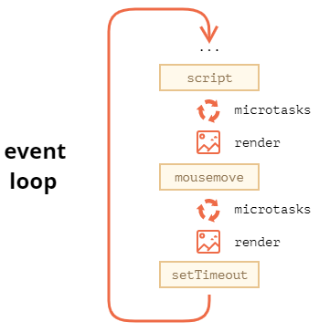

# 事件循环，任务和微任务

浏览器是多线程多进程架构，至少包括：JS 引擎线程，GUI 渲染线程，事件触发线程。

- JS 是单线程的，并且与 GUI 线程互斥。
- GUI 渲染线程负责渲染浏览器界面，当界面需要重排、重绘或由于某种操作引发回流时，该线程就会执行。GUI 渲染线程与 JS 引擎是互斥的，当 JS 引擎执行时 GUI 线程会被挂起，GUI 更新会被保存在一个队列中等到 JS 引擎空闲时立即被执行。
- 事件触发线程：当一个事件被触发时该线程会把事件添加到待处理队列的队尾，等待 JS 引擎的处理。这些事件可来自 JS 引擎当前执行的代码块如 setTimeOut、也可来自浏览器内核的其他线程如鼠标点击、AJAX 异步请求等，但由于 JS 的单线程关系所有这些事件都得排队等待 JS 引擎处理。  

## 事件循环 event loop

浏览器的 js 执行时单线程的，为了协调事件触发，交互，脚本执行，页面渲染，网络请求，浏览器将[eventloop](https://html.spec.whatwg.org/multipage/webappapis.html#event-loops)作为任务处理模型。根据标准，任务分成了 task 和 microTask。

## task  

task 有以下几种：
>
>- Events  
>Dispatching an Event object at a particular; EventTarget object is often done by a dedicated task.  
>Not all events are dispatched using the task queue; many are dispatched during other tasks.
>
>- Parsing  
>The HTML parser tokenizing one or more bytes, and then processing any resulting tokens, is typically a task.
>
>- Callbacks  
>Calling a callback is often done by a dedicated task.
>
>- Using a resource  
>When an algorithm fetches a resource, if the fetching occurs in a non-blocking fashion then the processing of the resource once some or all of the resource is available is performed by a task.
>
>- Reacting to DOM manipulation  
>Some elements have tasks that trigger in response to DOM manipulation, e.g. when that element is inserted into the document.  
翻译一下为：

- 浏览器事件，有一个专门的 task queue 去维护，但不是所有的事件依赖 task queue 异步触发，也有许多事件是在执行 task 的时候同步触发的
- html 解析
- 异步函数的回调，如 ajax，setTimeout，setInterval
- 资源的处理

总结起来，属于 task 的有

- setTimeout，setInterval
- ajax
- 浏览器触发的 dom event
- window.postMessage
- MessageChannel

需要注意的是，在代码中触发的 dom event 是同步执行的，如下

```js
document.body.addEventListener('click', () = { 
  console.log('click');
});
console.log(1);
document.body.click();
document.body.dispatchEvent(new Event('click'));
console.log(2);
// 1 click click 2
```

## 微任务 microtask

- Promise 回调，如 `Promise.resolve(callback)` 的 `callback`，但注意 `new Promise(executor)` 的 `executor` 是立即执行的，相当于同步代码，不是微任务
- MutationObserver
- queueMicrotask
- await 语句之后的函数，注意 `await new Promise(executor)` 的 `executor` 是立即执行的，`await console.log(122)` 也是立即执行的，相当于 `await new Promise(() => console.log(122))`
- 对 await 进行 try catch 中的 catch，下面的 `console.log(e)` 是微任务

```js
try { 
  await Promise.reject('error');
} catch(e) { 
  console.log(e);
}
```

## 一次事件循环

按照 [标准事件循环模型](https://html.spec.whatwg.org/multipage/webappapis.html#event-loop-processing-model)，一次事件循环的执行郭晨如下：
>
>1. Let taskQueue be one of the event loop's task queues, chosen in an implementation-defined manner, with the constraint that the chosen task queue must contain at least one runnable task. If there is no such task queue, then jump to the microtasks step below.  
> Remember that the microtask queue is not a task queue, so it will not be chosen in this step. However, a task queue to which the microtask task source is associated might be chosen in this step. In that case, the task chosen in the next step was originally a microtask, but it got moved as part of spinning the event loop.
>
>2. Let oldestTask be the first runnable task in taskQueue, and remove it from taskQueue.
>
>3. Set the event loop's currently running task to oldestTask.
>
>4. Let taskStartTime be the current high resolution time.
>
>5. Perform oldestTask's steps.
>
>6. Set the event loop's currently running task back to null.
>
>7. Microtasks: Perform a microtask checkpoint.
>
>8. Let hasARenderingOpportunity be false.
>
>9. Let now be the current high resolution time. [HRT]
>
>10. Report the task's duration by performing the following steps:
>
>     1. Let top-level browsing contexts be an empty set.
>
>     2. For each environment settings object settings of oldestTask's script evaluation environment settings object set, append setting's top-level browsing context to top-level browsing contexts.
>
>     3. Report long tasks, passing in taskStartTime, now (the end time of the task), top-level browsing contexts, and oldestTask.
>
>11. Update the rendering: if this is a window event loop, then:
>
>     1. Let docs be all Document objects whose relevant agent's event loop is this event loop, sorted arbitrarily except that the following conditions must be met:
>
>         - Any Document B whose browsing context's container document is A must be listed after A in the list.
>
>         - If there are two documents A and B whose browsing contexts are both child browsing contexts whose container documents are another Document C, then the order of A and B in the list must match the shadow-including tree order of their respective browsing context containers in C's node tree.
>
>         In the steps below that iterate over docs, each Document must be processed in the order it is found in the list.
>
>     2. Rendering opportunities: Remove from docs all Document objects whose browsing context do not have a rendering opportunity.
>
>         A browsing context has a rendering opportunity if the user agent is currently able to present the contents of the browsing context to the user, accounting for hardware refresh rate constraints and user agent throttling for performance reasons, but considering content presentable even if it's outside the viewport.
>
>         Browsing context rendering opportunities are determined based on hardware constraints such as display refresh rates and other factors such as page performance or whether the page is in the background. Rendering opportunities typically occur at regular intervals.
>
>         This specification does not mandate any particular model for selecting rendering opportunities. But for example, if the browser is attempting to achieve a 60Hz refresh rate, then rendering opportunities occur at a maximum of every 60th of a second (about 16.7ms). If the browser finds that a browsing context is not able to sustain this rate, it might drop to a more sustainable 30 rendering opportunities per second for that browsing context, rather than occasionally dropping frames. Similarly, if a browsing context is not visible, the user agent might decide to drop that page to a much slower 4 rendering opportunities per second, or even less.
>
>     3. If docs is not empty, then set hasARenderingOpportunity to true.
>
>     4. Unnecessary rendering: Remove from docs all Document objects which meet both of the following conditions:
>
>         - The user agent believes that updating the rendering of the Document's browsing context would have no visible effect, and
>         - The Document's map of animation frame callbacks is empty.
>     5. Remove from docs all Document objects for which the user agent believes that it's preferrable to skip updating the rendering for other reasons.
>
>         The step labeled Rendering opportunities prevents the user agent from updating the rendering when it is unable to present new content to the user (there's no rendering opportunity).
>
>         The step labeled Unnecessary rendering prevents the user agent from updating the rendering when there's no new content to draw.
>
>         This step enables the user agent to prevent the steps below from running for other reasons, for example, to ensure certain tasks are executed immediately after each other, with only microtask checkpoints interleaved (and without, e.g., animation frame callbacks interleaved). Concretely, a user agent might wish to coalesce timer callbacks together, with no intermediate rendering updates.
>
>     6. For each fully active Document in docs, flush autofocus candidates for that Document if its browsing context is a top-level browsing context.
>
>     7. For each fully active Document in docs, run the resize steps for that Document, passing in now as the timestamp. [CSSOMVIEW]
>
>     8. For each fully active Document in docs, run the scroll steps for that Document, passing in now as the timestamp. [CSSOMVIEW]
>
>     9. For each fully active Document in docs, evaluate media queries and report changes for that Document, passing in now as the timestamp. [CSSOMVIEW]
>
>     10. For each fully active Document in docs, update animations and send events for that Document, passing in now as the timestamp. [WEBANIMATIONS]
>
>     11. For each fully active Document in docs, run the fullscreen steps for that Document, passing in now as the timestamp. [FULLSCREEN]
>
>     12. For each fully active Document in docs, run the animation frame callbacks for that Document, passing in now as the timestamp.
>
>     13. For each fully active Document in docs, run the update intersection observations steps for that Document, passing in now as the timestamp. [INTERSECTIONOBSERVER]
>
>     14. Invoke the mark paint timing algorithm for each Document object in docs.
>
>     15. For each fully active Document in docs, update the rendering or user interface of that Document and its browsing context to reflect the current state.
>
>12. If all of the following are true
>
>     - this is a window event loop
>     - there is no task in this event loop's task queues whose document is fully active
>     - this event loop's microtask queue is empty
>     - hasARenderingOpportunity is false  
>
>     then for each Window object whose relevant agent's event loop is this event loop, run the start an idle period algorithm, passing the Window. [REQUESTIDLECALLBACK]
>
>13. If this is a worker event loop, then:
>
>     1. If this event loop's agent's single realm's global object is a supported DedicatedWorkerGlobalScope and the user agent believes that it would benefit from having its rendering updated at this time, then:
>
>         1. Let now be the current high resolution time. [HRT]
>
>         2. Run the animation frame callbacks for that DedicatedWorkerGlobalScope, passing in now as the timestamp.
>
>         3. Update the rendering of that dedicated worker to reflect the current state.
>
>             Similar to the notes for updating the rendering in a window event loop, a user agent can determine the rate of rendering in the dedicated worker.
>
>     2. If there are no tasks in the event loop's task queues and the WorkerGlobalScope object's closing flag is true, then destroy the event loop, aborting these steps, resuming the run a worker steps described in the Web workers section below.
>

简化一下，翻译成中文大致为：

1. 从众多 task queue 中挑选出一个不为空的 task queue 执行，如果每一个 task queue 是空的，则直接去执行微任务  
2. 从挑选出来的 task queue 中取出最旧的任务执行
3. 开始 [检查并清空微任务](https://html.spec.whatwg.org/multipage/webappapis.html#perform-a-microtask-checkpoint)，只要微任务队列不为空，就会一直执行微任务，中间如果有新的微任务进入微任务队列，也会继续清空微任务队列

4. 更新页面。
    1. 浏览器渲染页面的频率基于硬件的刷新率和其他因素（如页面是否在后台运行）做调整。如果刷新率为 60Hz，浏览器每秒钟渲染 60 次，即 16.7ms 一帧。如果浏览器无法保持这个刷新率，就会降频至 30Hz。如果当前页面在后台，浏览器会降频至每秒 4 帧甚至更少。然而每一轮的 eventloop 或快或慢，浏览器是不可能每次 eventloop 都进行更新的。另外，如果浏览器认为这次更新不会产生可见的效果并且没有 requestAnimationFrame 事件，也不会进行本次的更新。  
    2. 如果本次需要更新，浏览器根据按顺序执行以下步骤：刷新需要 autofocus 的候选者，执行 resize，scroll 事件（注意这里，当页面滚动时，页面会马上滚动，然后将时间添加到 pending scroll evnet targets 中，最后才触发 scroll 事件，由于事件都会整合到 eventloop 中，这里不是马上执行，而是将事件推到 task queue 中），解析 media query，更新动画并且派发动画事件，执行 RAF，执行 IntersectionObserver 回调，最后绘制到页面上  

综上所述，一次事件循环不一定会有页面的重新渲染
<!--  -->


## 示例

### 示例1

```js
Promise.resolve().then(() => {
  console.log('promise1');
}).then(() => {
  console.log('promise2');
})
setTimeout(() => {
  console.log('setTimeout');
});
console.log('123');
```

1. 第一轮事件循环，取出当前的任务，即上面的所有代码执行
2. 执行到 Promise.resolve().then，往微任务队列推一个微任务
3. 接着执行 setTimeout，往任务队列推一个任务
4. 执行 console.log('123')
5. task 执行完，检查微任务队列，输出 promise1
6. 继续检查微任务队列，输出 promise2
7. 本次事件循环结束，开始下一轮事件循环，输出 setTimeout

### 示例2

以下代码为各种情况的组合

```js
console.log('script start');

setTimeout(() => {
  console.log('setTimeout');
});

Promise.resolve()
.then(function() {
  console.log('promise1');
}).then(function() {
  console.log('promise2');
});

async function foo() {
  await bar();
  console.log('foo end');
}
foo();

async function errorFn () {
  try {
    await Promise.reject('error');
  } catch(e) {
    console.log(e);
  }
  console.log('errorFn execute');
  return Promise.resolve('errorFn resolve');
}
errorFn().then(res => console.log(res));

function bar() {
  console.log('bar end') 
}

console.log('script end');

```

## 思考

### 为什么动画都建议在 RAF 中调用，而不是 setTimeout

因为 setTimeout 属于 task，它和页面的真正渲染还相差这微任务，如果微任务过长，那页面渲染就会响应的延迟；然而 RAF 则是在微任务清空之后，页面渲染之前调用，这样能够保证动画更加流畅。

## 注意

- 浏览器是多进程多线程架构
- 浏览器渲染进程包括 GUI 渲染线程，JS 引擎线程，事件触发线程，定时触发器线程，异步http请求线程
- dom 的更新渲染发生在 JS 计算之后，再具体的说是在微任务执行之后
- GUI 渲染线程和 JS 引擎线程是互斥的
- 浏览器的冒泡和 dom 事件的行为是一致的，如果是代码触发的冒泡，则是同步执行；如果是浏览器触发的冒泡，则下一次冒泡事件会以 task 的形式提交到任务队列执行，可以查看这个[demo](https://codesandbox.io/s/eventloop-h063j?file=/src/index.js)

## 参考

- [Event loop: microtasks and macrotasks](https://zh.javascript.info/event-loop)
- [JavaScript的DOM事件回调不是宏任务吗，为什么在本次微任务队列触发？](https://www.zhihu.com/question/362096226)
- [深入解析 EventLoop 和浏览器渲染、帧动画、空闲回调的关系](https://zhuanlan.zhihu.com/p/142742003)
- [Vue源码详解之nextTick：MutationObserver只是浮云，microtask才是核心](https://github.com/Ma63d/vue-analysis/issues/6)
- [JavaScript: How Is Callback Execution Strategy For Promises Different Than DOM Events Callback?](https://www.zeolearn.com/magazine/javascript-how-is-callback-execution-strategy-for-promises-different-than-dom-events-callback)
