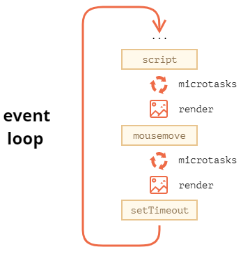

# 事件循环，宏任务，微任务

浏览器是多线程多进程架构，至少包括：JS 引擎线程，GUI 渲染线程，事件触发线程。

- JS 引擎是基于事件驱动单线程执行的，无论什么时候都只有一个 JS 线程在运行 JS 程序。
- GUI 渲染线程负责渲染浏览器界面，当界面需要重排、重绘或由于某种操作引发回流时，该线程就会执行。GUI 渲染线程与 JS 引擎是互斥的，当 JS 引擎执行时 GUI 线程会被挂起，GUI 更新会被保存在一个队列中等到 JS 引擎空闲时立即被执行。
- 事件触发线程：当一个事件被触发时该线程会把事件添加到待处理队列的队尾，等待 JS 引擎的处理。这些事件可来自 JS 引擎当前执行的代码块如 setTimeOut、也可来自浏览器内核的其他线程如鼠标点击、AJAX 异步请求等，但由于 JS 的单线程关系所有这些事件都得排队等待 JS 引擎处理。  

JS 引擎的工作机制是：当线程中没有执行任何同步代码的前提下才会执行异步代码

## 事件循环 event loop

事件循环为事件触发线程和 JS 引擎线程的对事件的处理机制  
大致流程为：先执行同步代码，再清空微任务队列（执行微任务，render），再执行宏任务，此时如果有新的微任务，会先去处理微任务队列，直到微任务队列为空，再回来处理宏任务队列，如此反复...直到宏任务队列清空，这就是一次事件循环  



## 宏任务 macrotask

- setTimeout
- setInterval
- 浏览器触发的 onclick，onmousemove 等 dom 回调事件
- 要注意人工触发的 dom 回调不是宏任务，如下

```js
document.querySelector('body').addEventListener('click', () => { 
  console.log('click');
});
console.log(1);
// 以下两种触发导致的回调都是同步的
document.querySelector('body').click();
document.querySelector('body').dispatchEvent(new Event('click'));
console.log(2);
```

## 微任务 microtask

- Promise 回调，如 `Promise.resolve(callback)` 的 `callback`，但注意 `new Promise(executor)` 的 `executor` 是立即执行的，相当于同步代码，不是微任务
- MutationObserver
- queueMicrotask
- await 语句之后的函数，注意 `await new Promise(executor)` 的 `executor` 是立即执行的，`await console.log(122)` 也是立即执行的，相当于 `await new Promise(() => console.log(122))`
- 对 await 进行 try catch 中的 catch，下面的 `console.log(e)` 是微任务

```js
try { 
  await Promise.reject('error');
} catch(e) { 
  console.log(e);
}
```

## 示例

先看以下三个例子执行时的队列情况

```js
// 示例1
let i = 1;
while (i) {
  i++;
  console.log(123);
}
```

页面会一直在打印 123，然后卡死，JS 线程一直卡在了执行 srcipt 代码的步骤

```js
// 示例2
let i = 1;
while (i) {
  setTimeout(() => {
    i++;
    console.log(123);
  })
}
```

也会卡死，JS 线程一直在处理 while 循环，并且一边在往宏任务队列推事件
JS 线程一直卡在了执行 srcipt 代码的步骤，还没到处理宏任务队列这一步，永远都不会打印出 123

```js
// 示例3
let i = 1;
setTimeout(() => {
  while (i) {
    i++;
    console.log(123);
  }
})
```

卡死，会一直打印出 123  
宏任务队列只有一个事件，就是 while 循环，出队列后 JS 线程一直在执行这个死循环  

再进一步深入，观察同步代码，宏任务，微任务的执行顺序

```js
Promise.resolve().then(() => {
  console.log('promise1');
}).then(() => {
  console.log('promise2');
})
setTimeout(() => {
  console.log('setTimeout');
});
console.log('123');
```

1. 首先运行同步代码代码，Promise.resolve() => then，此时会往微任务队列添加一个事件，即 console.log('promise1')，再执行到第二个 then，由于 promise 的机制，这个时候并不会马上添加到微任务队列，只有等上一个 promise resolve 之后才会添加 promise2 的语句到微任务队列，此时微任务队列有一个事件
2. 执行到 setTimeout 语句，此时往宏任务队列添加一个事件，即 console.log('setTimeout')，此时宏任务队列有一个事件
3. 执行到 console.log('123')，打印出 123
4. 到此当前同步代码运行结束
5. 开始检查微任务队列，有一个事件，事件推出队列执行，打印出 promise1，此时第一个 promise 已经 resolve，将 console.log('promise2') 推入微任务队列，此时微任务队列有一个事件
6. 继续检查微任务队列，执行并打印出 promise2
7. 继续检查微任务队列，直到微任务队列为空...
8. 开始检查宏任务队列，将事件推出队列执行，打印出 setTimeout
9. 继续检查宏任务队列，直到宏任务队列为空...

## 复杂示例

以下代码为各种情况的组合，如果能正确的说出打印顺序，那就说明你已经掌握了 eventloop

```js
console.log('script start');

setTimeout(() => {
  console.log('setTimeout');
});

Promise.resolve()
.then(function() {
  console.log('promise1');
}).then(function() {
  console.log('promise2');
});

async function foo() {
  await bar();
  console.log('foo end');
}
foo();

async function errorFn () {
  try {
    await Promise.reject('error');
  } catch(e) {
    console.log(e);
  }
  console.log('errorFn execute');
  return Promise.resolve('errorFn resolve');
}
errorFn().then(res => console.log(res));

function bar() {
  console.log('bar end') 
}

console.log('script end');

```

## 注意

- 浏览器是多进程多线程架构
- 浏览器渲染进程包括 GUI 渲染线程，JS 引擎线程，事件触发线程，定时触发器线程，异步http请求线程
- dom 的更新渲染发生在 JS 计算之后，再具体的说是在微任务执行之后
- GUI 渲染线程和 JS 引擎线程是互斥的

## 参考

- [Event loop: microtasks and macrotasks](https://zh.javascript.info/event-loop)
- [JavaScript的DOM事件回调不是宏任务吗，为什么在本次微任务队列触发？](https://www.zhihu.com/question/362096226)
