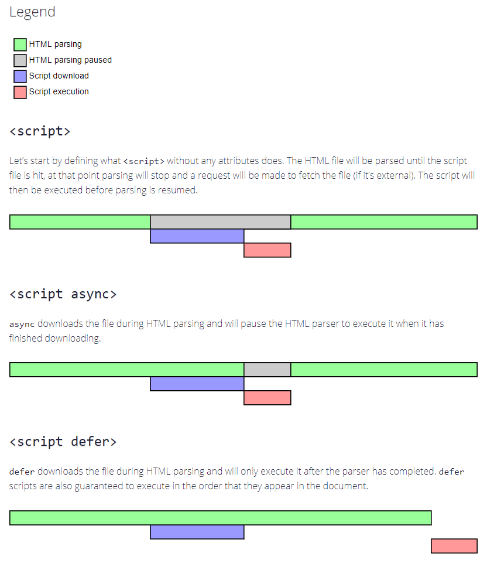

# 前端模块化

javascript 早期只是作为网页的脚本任务使用，提供简单的交互。随着网页越来越庞大，功能愈加复杂，javascript 已经超出了当初的设计期望，社区一直在不断地探索，完善标准，模块化就正是其中至关重要的一部分。

## IIFE

立即调用函数表达式（英文：immediately-invoked function expression，缩写：IIFE）  
IIFE 有自己的独立作用域，不会污染全局变量。IIFE 是模块化的雏形。

### IIFE 怎么定义模块

```js
// IIFE 示例
// my-module-iife.js
var myModule = (() => {
  var x = 20;
  function add() {
    x++;
    console.log(x);
  }
  return {
    add
  }
})();
```

或者

```js
// IIFE 示例
// my-module-iife.js
((window) => {
  var x = 20;
  const myModule = {
    add() {
      x++;
      console.log(x);
    }
  }
  window.myModule = myModule;
})(window);
```

上述代码将 window 对象作为参数传入立即执行函数，再将我们定义的对象挂载到 window 上，局部变量 x 被永久保存下来，并且无法被外部直接访问  
使用时通过 `<script type="text/javascript" src="./my-module-iife.js"></script>` 引入  
假设我们不用 IIFE，只是单纯用 namespace 隔离，如下所示，x 变量是直接定义在全局的，会污染全局变量。

```js
// my-module.js
// 没有 local scope，不安全
var x = 20;
const myModule = {
  add() {
    x++;
    console.log(x);
  }
}
window.myModule = myModule;
```

### 为 IIFE 添加依赖

首先通过 script 标签提前引入依赖，然后将依赖作为参数传入 IIFE，下面以 jQuery 为例

```html
<script type="text/javascript" src="jquery.js"></script>
<script type="text/javascript">
  var myModule = (($) => {
    var x = 20;
    function add() {
      x++;
      console.log(x);
      console.log($('body').width());
    }
    return {
      add
    }
  })(window.jQuery);
  myModule.add();
</script>
<script type="text/javascript">
  myModule.add();
</script>
```

### IIFE 小结

到此为止，IIFE + script 已经能够实现模块的加载和依赖了，但是还存在以下缺点：

1. 如果模块之间有依赖，引入时 script 标签的位置很重要，难以维护
2. 每一个模块都用单独的 script 引入会增加 http 的请求
3. 最终还是将对象挂载到 window 下

以上的问题，都可以通过一些办法去避免  
YUI 是雅虎在 2006 年开源的一个 UI 框架，其中包含的 seed file 是一个模块加载器
通过以下的方法创建和使用模块

```js
YUI.add('my-module', function (Y) {
  Y.MyModule = {
    sayHello() {
      console.log('Hello!');
    }
  };
});
YUI().use('my-module', function (Y) {
  Y.MyModule.sayHello();
});
```

通过 `YUI.GlobalConfig` 管理依赖，通过 comboBase 合并多个依赖到同一个 http 请求中（前提是要服务器配合），大致配置如下

```js
YUI.GlobalConfig = {
  groups: {
    utils: {
      // specify whether or not this group has a combo service
      combine: true,
      // The comboSeperator to use with this group's combo handler
      comboSep: ';',
      // The maxURLLength for this server
      maxURLLength: 500,
      // the base path for non-combo paths
      base: 'http://yui.yahooapis.com/2.8.0r4/build/',
      // the path to the combo service
      comboBase: 'http://yui.yahooapis.com/combo?',
      // a fragment to prepend to the path attribute when
      // when building combo urls
      root: '2.8.0r4/build/',
      // the module definitions
      modules: {
        module1: '/path/to/my/module1.js',
        module2: '/path/to/my/module1.js',
      }
    }
  }
};
```

## commonJs

commonJs 是 nodeJs 的模块化规范

```js
// myModule.js
var name = 'myModule';
function getName() {
  console.log(name);
}
module.exports = {
  getName
}
// 或者
// exports.getName = getName;


// index.js
const myModule = require('myModule.js');
myModule.getName();
```

### 注意的细节

1. require 是同步的
2. 导出有三种方式 `module.export = { xxx }` 、`module.export.xxx = xxx` 、 `exports.xxx = xxx`，但不能直接对 exports 赋值，如 `exports = { xxx }`，因为 exports 只是一个指向 module.export 的私有变量，重新赋值是不会修改到 module.export 的

3. 导出的是值传递或者引用类型，类似于函数传参

## amd

异步模块定义（英文：Asynchronous Module Definition，缩写：amd）  
由于 commonJs 加载模块是同步的，如果按照其书写风格的话，在当年那个没有 webpack 的年代，并不适用于浏览器。
requireJs 是2011年开源的一个 amd 规范的模块加载器，通过函数包装的语法加载模块

```js
// 定义一个模块 a.js
define(['utils.js'], function(utils) {
  var add = function(x,y) {
    console.log(utils);
    return x + y;
  };
  return {
    add
  };
});
// 在 b.js 中使用 a.js
require(['a.js'], function(a) {
  alert(a.add(1, 1));
});
```

## cmd

cmd 是 seaJs 提出的模块概念，并没有成为规范。  
seaJs 是在 requireJs 的基础上更贴合 commonJs 的书写风格
只要经过了 define 的包装，就可以像 nodeJs 一样书写代码。

```js
// 所有模块都通过 define 来定义
define(function(require, exports, module) {
  // 通过 require 引入依赖
  var $ = require('jquery');
  var Spinning = require('./spinning');
  // 通过 exports 对外提供接口
  exports.doSomething = ...
  // 或者通过 module.exports 提供整个接口
  module.exports = ...
});
```

也兼容了 requireJs 的书写风格

```js
define(['a', 'b'], function(a, b){
  a.doSomething();
  b.doSomething();
})
```

## umd

通用模块定义（英文：Universal Module Definition，缩写：umd）  
从前文可以了解到，amd 规范用于浏览器，commonJs 用于 nodeJs，为了解决跨平台问题，于是便有两种规范的结合。
实现原理就是做一层 polyfill，根据环境使用的规范去导出。

```js
// if the module has no dependencies, the above pattern can be simplified to
(function (root, factory) {
  if (typeof define === 'function' && define.amd) {
    // AMD. Register as an anonymous module.
    define([], factory);
  } else if (typeof exports === 'object') {
    // Node. Does not work with strict CommonJS, but
    // only CommonJS-like environments that support module.exports,
    // like Node.
    module.exports = factory();
  } else {
    // Browser globals (root is window)
    root.returnExports = factory();
  }
}(this, function () {
  // Just return a value to define the module export.
  // This example returns an object, but the module
  // can return a function as the exported value.
  return {};
}));
```

## 插曲

此时，随着 nodeJs 的流行，我们可以使用 nodeJs 做一些词法分析和代码转换。例如 browserify，我们在浏览器端也可以完全使用 commonJs 的书写风格。

```js
var foo = require('lib/foo');
module.export = { bar() {} };
```

`browserify lib/foo.js >> modules.js` 转换成

```js
require.define('lib/foo', function (require, module, exports) {
  // actual code defined in lib/foo.js
  module.exports = {
    bar() {}
  };
});
```

之后，便有了 babel，gulp，grunt，webpack，rollup 一系列编译工具链，开启了前端工程化的时代。

## esModule

esModule 是 es6 中浏览器对模块化的原生支持，只能用于 `<script type="module"></script>` 中。浏览器执行到 import 语句时会发起一个请求。另外 esModule 导出的变量都是只读的，不能在外部修改。  
esModule 的部分语法如下

```js
// myModule.js
export let counter = 1;
export function add() {
  counter++;
}

// index.js
import * as myModule from './myModule.js';
myModule.add();
```

### esModule 的导出

需要注意的是 esModule 默认导出和普通导出是有表现差异的。  

1. 使用 export 导出的变量都是强绑定

```js
// a.js
export let counter = 1;
export function add() {
  counter++;
  return counter;
}

// index.js
import * as a from './a';
console.log(a.counter); // 1
console.log(a.add());   // 2
console.log(a.counter); // 2
```

2. 使用 export default 导出的变量类似于函数传参的效果，简单类型不会共享，复杂类型会共享

```js
// a.js
let counter = 1;
function add() {
  counter++;
  return counter;
}
export default {
  counter,
  add
}

// index.js
import a from './a.js';
console.log(a.counter); // 1
console.log(a.add());   // 2
console.log(a.counter); // 1
```

## esModule 和 commonJs 的区别

由于 commonJs 的 require 本质上是个普通函数，module.export 也只是个对象。所以可以再任何地方执行 require，导出任何想导出的东西，如

```js
const flag = Math.round(Math.random() * 100) % 2;
if (flag) {
  module.export = require('./a.js');
} else {
  module.export = require('./b.js');
}
// 或者
module.exports[localStorage.getItem(Math.random())] = () => { … };
```

commonJs 动态引入和静态引入的语法是一致的，构建工具无法在构建时知道导出的符号是什么名称，因为这里需要的信息可能会出现在用户浏览器的上下文中，所以编译器无法正确地进行优化。  
而 esModule 是采用关键字的形式，import 只能放在顶层，动态引入和静态引入有很好的区分。  
总的来说，两者的差异为

- esModule 的静态特性更有利于 tree shaking，对编译器友好
- esModule export 导出变量是强绑定（简单类型和引用类型都会共享），export default 的是值的拷贝，和 commonJs 一样，类似于函数传参

## 拓展和思考

### tree shaking

tree shaking 是指在代码引入/定义后没有使用到的情况下，会将代码删除。
commonJs 规范太过灵活，不适合做 tree shaking，esModule 是静态引入，容易做 tree shaking。
对第三方 npm 模块 tree shaking 的前提是该模块有 esModule 规范的 es5 语法的入口。

#### 如何编写 tree shaking 友好的代码

tree shaking 需要 npm 模块的支持，以 webpack 为例，如果是第三方 npm 模块的话，需要在 package.json 配置 module 和 sideEffects 字段。

1. 在编写 npm 包时，需要打包出基于 es6 模块语法，使用 es5 语法编写的目录，并且配置 pkg.module
2. 在 pkg.sideEffects 字段，指出有副作用的代码（引入没用到也不要删掉的代码），防止代码被编译器误删
  
经实测，webpack4、webpack5 在 production mode 都会默认开启 tree shaking，对使用 esModule 的语法（不管是 export 还是 export default）都能够做到 tree shaking，而使用 commonJs 规范的语法是无法进行 tree shaking 的。

所以在项目平时使用时，用 esModule 语法，而不是用 commonJs 语法。

#### package.json 相关的字段

- files：下载该 npm 包时包含的文件夹
- main：引入该 npm 包时的入口文件，一般都是 commonJs 规范的入口文件
- brower：浏览器环境下，如 webpack 配置 target 时引入该 npm 包时的入口文件
- module：该字段还未成为 npm 规范。webpack，rollup 为 tree shaking 指定的基于 ES6 模块规范的使用 ES5 语法书写的入口文件
- sideEffects：该字段还未成为 npm 规范，是 webpack 4 新增的特性。表示告诉 webpack，在开启了 tree shaking 后，该配置项包含的模块，即使引入了没有被使用，也不要把它给删掉。一般会把样式文件放进去，或者是某些 polyfill 功能的代码。

```js
 "sideEffects": [
    "es/**/style/*",
    "lib/**/style/*",
    "*.css",
    "*.less"
  ],
```

优先级：优先根据构建工具的配置，如 webpack 的 `resolve.mainFields`。一般来说，main 的优先级最低。  
在 webpack 中，如果配置了 `target: 'web'`，优先级为 'browser' > 'module' > 'main'，也可手动配置 `resolve.mainFields`

### 普通 script 和 type="module" script 的区别

- 模块脚本不能直接打开，需要通过服务器打开，否则会报 cors 错误
- 模块脚本自动使用严格模式
- 模块脚本不需要使用 defer 属性，模块会自动延迟加载，行为和 defer 一致

### script 标签的 async 和 defer 属性

首先复习一下 `DOMContentLoaded` 和 `load`

- `DOMContentLoaded`：当 html 文档被下载并解析完成，包括同步 script 脚本的下载和解析，具有 defer 属性的 script 脚本的下载和解析
，不包括 css 解析，iframe 的加载，具有 async 属性的 script 脚本，和 document.createElement('script) 创建的脚本
- `load`：整个页面，包括样式、图片和其他异步资源被加载解析完成时

#### defer 延迟加载

- 声明 defer 属性的脚本会在后台下载，等 DOM 树构建完成之后再执行，执行的时候页面已经渲染完毕
- 声明 defer 属性的脚本，但在 `DOMContentLoaded` 事件之前执行，会阻塞 `DOMContentLoaded` 事件
- 多个声明 defer 的脚本，会并行下载，并会按照声明的顺序执行脚本，而不是下载完成的顺序，即脚本之间会相互等待

#### async 异步加载

- 声明 async 属性的脚本会在后台下载，下载完立即执行，下载是不会阻塞页面渲染，但执行时会阻塞页面渲染
- 声明 async 属性的脚本总是要等到 DOM 解析完毕时触发，但不会阻塞 `DOMContentLoaded` 事件，可能会在之前或之后触发，取决于脚本下载的时间
- 多个声明 async 的脚本，会并行下载，并在下载完成之后执行，不会等待其他 async 脚本，即谁先下载完谁执行

#### 动态脚本

通过 `createElement('script')` 创建的脚本，默认行为是 async，即先加载先执行，当指定了 `script.async = false` 时，执行顺序会和 append 到页面的顺序一样

#### 使用场景

- 如果脚本是完全独立的，使用 async，如百度数据统计
- 如果脚本依赖于其他脚本，使用 defer
- 如果脚本比较小并且被另一个 async 脚本依赖，使用不带 async 和 defer 属性的 script 标签，并且放在该 async 脚本前面

[](https://www.growingwiththeweb.com/2014/02/async-vs-defer-attributes.html)

## 参考

- [script-async-defer - javascript.info](https://zh.javascript.info/script-async-defer)
- [async vs defer attributes - growingwiththeweb](https://www.growingwiththeweb.com/2014/02/async-vs-defer-attributes.html)
- [javaScript 模块化七日谈](http://huangxuan.me/2015/07/09/js-module-7day/)
- [深入解析ES Module（一）：禁用export default object](https://zhuanlan.zhihu.com/p/40733281)
- [不要再依赖 commonJs 了](https://www.infoq.cn/article/dckcjit8aeebnzbdotff)
