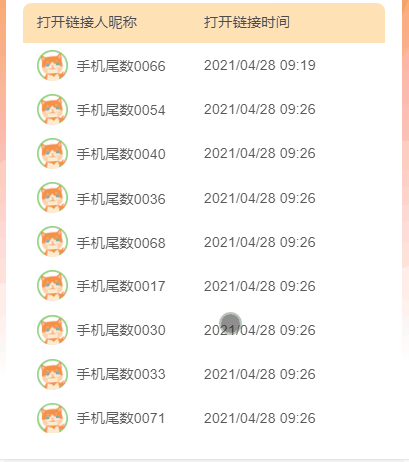

# vue nextTick

vue 的 nextTick 源码都在一个文件 src/core/util/next-tick.js，该文件不止是暴露出 Vue.prototype.$nextTick 用，并且应用于 vue 的整个响应式更新过程中，vue 中对 data 的赋值而产生的视图更新，都会使用 nextTick 去做处理。  
所以说 nextTick 是 vue 的核心代码也不会过，nextTick 也经历了几次宏任务和微任务的更改，到目前的版本是默认采用微任务。
关于 nextTick 的 issue 也不少，如 [#6566](https://github.com/vuejs/vue/issues/6566)，[#3771](https://github.com/vuejs/vue/issues/3771#issuecomment-249692588)。

## 基础知识

### 对data中的属性赋值后发生了什么

赋值之后，调用栈为  
proxySetter => reactiveSetter => notify => update => queueWatcher => nextTick => flushCallbacks（更新视图）

### 浏览器的事件循环

具体可以看 [eventloops](https://html.spec.whatwg.org/multipage/webappapis.html#event-loops)，大致流程为

1. 取出宏任务队列的一个任务执行
2. 执行过程中不断清空微任务队列，直到微任务队列为空
3. 执行 requestAnimationFrame，渲染，渲染完有空闲时间执行 requestIdleCallback
4. 本次事件循环结束

## 遇到的问题

在做虚拟列表的时候，vue 版本为 2.5.16，发现滚动时会出现闪烁。  
现象：列表初始为 1-10，滚动时变成 2-11，再变成 1-10，再变成 2-11，整个过程比较快，所以看起来有闪烁的现象。  
以下为虚拟列表的伪代码


```vue
<template>
  <ul @scroll="onScroll" ref="ul" id="wrapper">
    <li v-for="item in list" class="visual-item" >{{ item.name }}</li>
  </ul>
</template>
<script>
  export default {
    data: () => ({
      list: new Array(2000).fill({ name: 'item' }).map((item, index) => ({ name: `${item.name}-${index}` })),
      visualList: [],
      startIndex: 0,
      endIndex: 0,
      itemTopList: []
    }),
    methods: {
      onScroll(e) {
        const { scrollTop } = e.target
        this.startIndex = this.findIndex(scrollTop)
        this.endIndex = this.startIndex + 20
        this.visualList = this.list.slice(this.startIndex, this.endIndex)
        this.setPadding()
      },
      findIndex(scrollTop) {
        // 根据 scrollTop 找到当前滚动到的元素下标
        const index = this.itemTopList.find(top => top > scrollTop)
        return index ? index - 1 : 0
      },
      updateItemTopList() {
        // 获取 dom 节点，将列表中每个 dom 节点的 top 缓存起来
        this.itemTopList = Array.from(document.querySelector('.visual-item')).map(item => item.offsetTop)
      }
      setPadding() {
        // 设置 paddingTop 
        this.$refs.div.style.paddingTop = this.itemTopList[this.startIndex] + 'px'
      }
    }
  }
</script>
```

可以看出，在滚动时会触发两个行为： visualList 的更新和设置 paddingTop

- 更新 visualList：由于是 dom 回调事件，在 2.5.16 版本中，会将回调事件产生的 dom 更新放到下一次的宏任务执行
- 设置 paddingTop：由于是直接操作 dom 元素，所有会在本次事件循环中渲染

所以就导致一个问题：paddingTop 的更新比 visualList 的更新更早地渲染到视图中  
滚动开始，列表初始值为 1-10

- 即将滚动到第 2 个元素时，第 1 个元素已经几乎看不见了，在临界值，此时看到的可视区列表为 2-10（第 1 个元素在可视区外）
- 滚动到第 2 个元素，计算内存中的 visualList 为 2-10，计算 paddingTop，更新 paddingTop，但此时列表其实还未更新到视图，视图上看到的依旧是 1-10，paddingTop 更新后会往下推，可视区的列表就变成了 1-10
- 接着 visualList 的更新也渲染到视图了，列表变成了 2-11
所以，才会导致滚动的时候出现闪烁

### 解决思路

由上文我们已经知道，本质的原因是，在 dom 的回调实践中，直接操作 dom 的产生的视图更新会比 vue 中 data 的赋值产生的视图更新更快，前者是是在本次事件循环渲染，后者是在下一次事件循环渲染。那有没有办法让他们处于同一次事件循环中呢？  
在 2.5.16 版本的源码中[node_modules/vue/dist/vue.runtime.esm.js](https://github.com/vuejs/vue/blob/25342194016dc3bcc81cb3e8e229b0fb7ba1d1d6/dist/vue.runtime.esm.js#L6527)，我们可以尝试将绑定事件时的宏任务开关去掉，注释 `handler = withMacroTask(handler)`

```js
function add$1 (
  event,
  handler,
  once$$1,
  capture,
  passive
) {
  // 注释了这一行代码后，就是走微任务了
  // handler = withMacroTask(handler);
  if (once$$1) { handler = createOnceHandler(handler, event, capture); }
  target$1.addEventListener(
    event,
    handler,
    supportsPassive
      ? { capture: capture, passive: passive }
      : capture
  );
}
```

这时候发现已经不会出现闪烁的情况了，所以我们的分析是对的。  
以下为可以采用的解决方案：

- 不要通过 @scroll 绑定事件，用 addEventListener 绑定
- 升级 vue 版本到 2.6.x，从 2.6.x 起，dom 事件中设置 data 产生的更新，都会默认走微任务

## vue@2.5.x nextTick 源码

```js
const callbacks = []
let pending = false

function flushCallbacks () {
  pending = false
  const copies = callbacks.slice(0)
  callbacks.length = 0
  for (let i = 0; i < copies.length; i++) {
    copies[i]()
  }
}
let microTimerFunc
let macroTimerFunc
let useMacroTask = false
if (typeof setImmediate !== 'undefined' && isNative(setImmediate)) {
  macroTimerFunc = () => {
    setImmediate(flushCallbacks)
  }
} else if (typeof MessageChannel !== 'undefined' && (
  isNative(MessageChannel) ||
  // PhantomJS
  MessageChannel.toString() === '[object MessageChannelConstructor]'
)) {
  const channel = new MessageChannel()
  const port = channel.port2
  channel.port1.onmessage = flushCallbacks
  macroTimerFunc = () => {
    port.postMessage(1)
  }
} else {
  macroTimerFunc = () => {
    setTimeout(flushCallbacks, 0)
  }
}

if (typeof Promise !== 'undefined' && isNative(Promise)) {
  const p = Promise.resolve()
  microTimerFunc = () => {
    p.then(flushCallbacks)
    if (isIOS) setTimeout(noop)
  }
} else {
  // fallback to macro
  microTimerFunc = macroTimerFunc
}

/**
 * Wrap a function so that if any code inside triggers state change,
 * the changes are queued using a (macro) task instead of a microtask.
 */
export function withMacroTask (fn: Function): Function {
  return fn._withTask || (fn._withTask = function () {
    useMacroTask = true
    const res = fn.apply(null, arguments)
    useMacroTask = false
    return res
  })
}
export function nextTick (cb?: Function, ctx?: Object) {
  let _resolve
  callbacks.push(() => {
    if (cb) {
      try {
        cb.call(ctx)
      } catch (e) {
        handleError(e, ctx, 'nextTick')
      }
    } else if (_resolve) {
      _resolve(ctx)
    }
  })
  if (!pending) {
    pending = true
    if (useMacroTask) {
      macroTimerFunc()
    } else {
      microTimerFunc()
    }
  }
  // $flow-disable-line
  if (!cb && typeof Promise !== 'undefined') {
    return new Promise(resolve => {
      _resolve = resolve
    })
  }
}
```

## vue@2.6.x nextTick 源码

```js
export let isUsingMicroTask = false

const callbacks = []
let pending = false

function flushCallbacks () {
  pending = false
  const copies = callbacks.slice(0)
  callbacks.length = 0
  for (let i = 0; i < copies.length; i++) {
    copies[i]()
  }
}

// Here we have async deferring wrappers using microtasks.
// In 2.5 we used (macro) tasks (in combination with microtasks).
// However, it has subtle problems when state is changed right before repaint
// (e.g. #6813, out-in transitions).
// Also, using (macro) tasks in event handler would cause some weird behaviors
// that cannot be circumvented (e.g. #7109, #7153, #7546, #7834, #8109).
// So we now use microtasks everywhere, again.
// A major drawback of this tradeoff is that there are some scenarios
// where microtasks have too high a priority and fire in between supposedly
// sequential events (e.g. #4521, #6690, which have workarounds)
// or even between bubbling of the same event (#6566).
let timerFunc

// The nextTick behavior leverages the microtask queue, which can be accessed
// via either native Promise.then or MutationObserver.
// MutationObserver has wider support, however it is seriously bugged in
// UIWebView in iOS >= 9.3.3 when triggered in touch event handlers. It
// completely stops working after triggering a few times... so, if native
// Promise is available, we will use it:
/* istanbul ignore next, $flow-disable-line */
if (typeof Promise !== 'undefined' && isNative(Promise)) {
  const p = Promise.resolve()
  timerFunc = () => {
    p.then(flushCallbacks)
    // In problematic UIWebViews, Promise.then doesn't completely break, but
    // it can get stuck in a weird state where callbacks are pushed into the
    // microtask queue but the queue isn't being flushed, until the browser
    // needs to do some other work, e.g. handle a timer. Therefore we can
    // "force" the microtask queue to be flushed by adding an empty timer.
    if (isIOS) setTimeout(noop)
  }
  isUsingMicroTask = true
} else if (!isIE && typeof MutationObserver !== 'undefined' && (
  isNative(MutationObserver) ||
  // PhantomJS and iOS 7.x
  MutationObserver.toString() === '[object MutationObserverConstructor]'
)) {
  // Use MutationObserver where native Promise is not available,
  // e.g. PhantomJS, iOS7, Android 4.4
  // (#6466 MutationObserver is unreliable in IE11)
  let counter = 1
  const observer = new MutationObserver(flushCallbacks)
  const textNode = document.createTextNode(String(counter))
  observer.observe(textNode, {
    characterData: true
  })
  timerFunc = () => {
    counter = (counter + 1) % 2
    textNode.data = String(counter)
  }
  isUsingMicroTask = true
} else if (typeof setImmediate !== 'undefined' && isNative(setImmediate)) {
  // Fallback to setImmediate.
  // Technically it leverages the (macro) task queue,
  // but it is still a better choice than setTimeout.
  timerFunc = () => {
    setImmediate(flushCallbacks)
  }
} else {
  // Fallback to setTimeout.
  timerFunc = () => {
    setTimeout(flushCallbacks, 0)
  }
}

export function nextTick (cb?: Function, ctx?: Object) {
  let _resolve
  callbacks.push(() => {
    if (cb) {
      try {
        cb.call(ctx)
      } catch (e) {
        handleError(e, ctx, 'nextTick')
      }
    } else if (_resolve) {
      _resolve(ctx)
    }
  })
  if (!pending) {
    pending = true
    timerFunc()
  }
  // $flow-disable-line
  if (!cb && typeof Promise !== 'undefined') {
    return new Promise(resolve => {
      _resolve = resolve
    })
  }
}
```

在 2.6 中，nextTick 都是统一走微任务了，并且去掉了函数 `withMacroTask`。如果没有微任务相关的 api 或者 hack，才会降级到宏任务，优先级如下：

- Promise.resolve().then
- new MutationObserver()
- setImmediate
- setTimeout(, 0);

## 参考

- [Vue源码详解之nextTick](https://github.com/Ma63d/vue-analysis/issues/6)
- [eventloops-HTML Standard](https://html.spec.whatwg.org/multipage/webappapis.html#event-loops)
